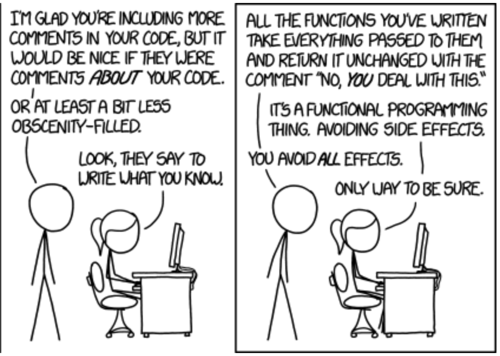

# Hva er funksjonell programmering?

BouvetOne 28.03.2023
Vegard Stenvik



---

> In computer science, functional programming is a programming paradigm where programs are constructed by applying and composing functions.
> -wikipedia

---

- Begreper
- Fordeler med FP

---

# Begreper 

- Rene funksjoner
- Immutabilitet
- Higher order functions

---

# Rene funksjoner

## Egenskaper
* Deterministiske
* Ingen sideeffekter
* Påvirker ikke omverdenen - eneste output er returverdi
* Referential transparency
* Muterer ikke input-parameterne

---

## Ikke-deterministisk

```typescript
function getYearsFromToday(date: Date): number {
    const now = new Date();
    return now.getYear() - date.getYear();
}
```

## Deterministisk
```typescript
function getYearsFromToday(date: Date, now: Date): int {
    return now.getYear() - date.getYear();
}
```

---

# Begrep: Sideeffekter

Betydning: *Endring* av noe utenfor en funksjon

```typescript
// Lagre til database
async function saveDataToDatabase(data: Data): Promise<void> {
    await _db.SaveData(data);
}

// Skrive til en output/logg
function logHallo(): void {
    console.log('Hallo')
}

// Skrive noe til et API
async function postTilApi(data): Promise<void> {
    const result = await http.post(data);
    if(result.ok)
        ...
}
```
---

```typescript
class Person {
    private string navn;
    private number alder;

    constructor(navn: string; alder: string){
        this.navn = navn;
        this.alder = alder;
    }

    public setAlder(alder: number): void {
        this.alder = alder;
    }
}
```

---

```typescript
function Example(a: number, b: boolean): void
```
---

```typescript
function Example(): number
```

---
```typescript
const PI = 3.1415

function hentOmkretsAvSirkel(circle: Circle): number {
    return 2 * circle.radius * PI;
}
```
---

## Referential transparency

```typescript
const add = (a, b) => a + b;

add(add(2, 3), 1) 

// Er nøyaktig det samme som

add(5, 1)
```

---

# Fordeler med rene funksjoner?

---

* Forutsigbare
* Lett å kombinere med andre funksjoner
* Lette å skrive enhetstester for
* Lett å cache resultatet
    * Memoisering

---

# Memoisering

```typescript
const tungBeregning = () => { console.log('hallo') }

tungBeregning()
// console: hallo
tungBeregning()
// console: hallo
tungBeregning()
// console: hallo

const memoizedTungBeregning = memoize(tungBeregning);

memoizedTungBeregning()
// console: hallo
memoizedTungBeregning()
memoizedTungBeregning()

```
---

# Høyere ordens funksjoner

<!-- Innlednigsvis handler fp om å komponere funkssjoner
     HOF er en måte å gjøre det på
-->

Funksjoner som tar andre funksjoner som parameter

map: gjør *noe* med hvert element i en liste


```f#
// toUppercase: string -> string
let toUppercase str = ...

// toUppercaseList: string[] -> string[]
let toUppercaseList list = List.map toUppercase

toUppercaseList ['Hund', 'Katt', 'Frosk'] //['HUND', 'KATT', 'FROSK']

```

---

# FP vs. OOP

---

## Tilstand

> (...) The reason that many of these errors exist is that the presence of state makes programs hard to understand. It makes them complex.
> -- *B. Moseley, P. Marks (2006), Out of the Tar Pit*


---

OOP

- Klasser = data + oppførsel

```C#
public class Ansatt {
    public string Name { get; set; }
    public DateTime Birthdate { get; set; }
    public int Ansennitet { get; set; }

    public Human(string name, DateTime birthdate)
    {
        Name = name;    
        Birthdate = birthdate;
        Ansennitet = 0;
    }

    public int GetAge()
    {
        ...
    }
}
```

---

FP

- data og oppførsel separat

```F#
type Ansatt = {
    name: string;
    birthdate: DateTime;
}

let getAge human = ...

```

---

# Tilstand vs. Data

Når klasser har metoder for å oppdatere seg selv, oppfordrer dette til mutasjon. Mutasjon betyr at et objekt kan ha ulike tilstander.

Ved å begrense mutasjon, må tvinges vi til å være bevviste på hvor i en applikasjon vi har tilstand.

---

```c#
var kari = new Ansatt("Kari", new Date(1990, 1, 1));

var bedrift = new Bedrift("Konsulentselskapet AS");

Ansettelsesforhold ansettelsesforhold = bedrift.Ansett(kari);

ansattelsesforhold.BeregnAnsennitet();
ansattelsesforhold.Lagre();

kari.GetAge(); // Resultat: 0
```

---

```f#
let kari = { name = "Kari", birthdate = DateTime(1990, 1, 1) }

let bedrift = { name = "Konsulentselskapet AS" );

let ansettelsesforhold = Bedrift.ansett bedrift kari

let kariMedAnsennitet = { kari with ansennitet = ansattelsesforhold.BeregnAnsennitet() }
ansattelsesforhold.Lagre();

kari.GetAge(); // Resultat: 33
```

---

* HIGHER ORDER FUNCTIONS
* TODO: ICOMPARABLE VS SORTBY
* Tail end recursion
